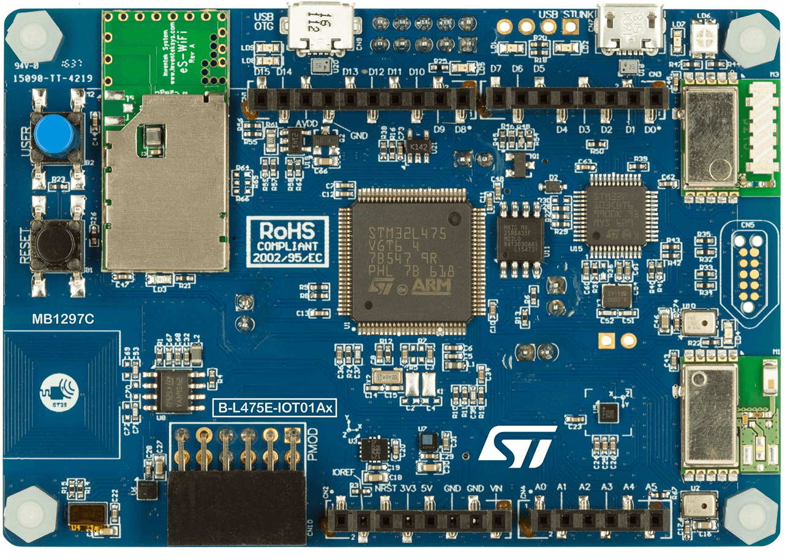

# BSP README 模板

## 简介

本文档为 B-L475E-IOT01A1 开发板的 BSP (板级支持包) 说明。

主要内容如下：

- 开发板资源介绍
- BSP 快速上手
- 进阶使用方法

通过阅读快速上手章节开发者可以快速地上手该 BSP，将 RT-Thread 运行在开发板上。在进阶使用指南章节，将会介绍更多高级功能，帮助开发者利用 RT-Thread 驱动更多板载资源。

## 开发板介绍

B-L475E-IOT01A1 是 ST 推出的一款基于 ARM Cortex-M4 内核的开发板，最高主频为 80Mhz，该开发板具有丰富的板载资源，可以充分发挥 STM32L475 的芯片性能。

开发板外观如下图所示：



该开发板常用 **板载资源** 如下：

- MCU：STM32L475VGT6，主频 80MHz，1MB FLASH ，128KB RAM
- 外部 FLASH：MX25R6435F，8MB (Quad-SPI)
- 常用外设
  - LED：4个，LD1（绿色，PA5），LD2（绿色，PB14）,LD3(黄色，PC9)，LD4（蓝色，PC9）
  - 按键：1个，B2（兼具唤醒功能，PC13）
  - 板载 ST LINK V2.1 功能
  - wifi 模块：ISM43362-M3G-L44
  - 蓝牙 4.1 模块：SPBTLE-RF
  - Sub-GHz 模块：SPSGRF
  - 2个数字麦克风：MP34DT01
  - 温湿度传感器：HTS221
  - 3轴磁场传感器：LIS3MDL
  - 3轴加速度、陀螺仪：LSM6DSL
  - 压力传感器：LPS22HB
  - TOF传感器：VL53L0X
  - 动态NFC标签：M24SR 
- 常用接口：USB 转串口、USB OTG
- 调试接口，标准 JTAG/SWD

开发板更多详细信息请参考【ST】 [B-L475E-IOT01A开发板介绍]([https://xxx](https://www.st.com/en/evaluation-tools/b-l475e-iot01a.html))。

## 外设支持

本 BSP 目前对外设的支持情况如下：

| **板载外设**      | **支持情况** | **备注**                              |
| :----------------- | :----------: | :------------------------------------- |
| USB 转串口        |     支持     |                                       |
| SPI Flash         |    暂不支持     |                                       |
| 以太网            |     暂不支持    |                                       |
| SD卡              |   暂不支持   |                                       |
| CAN               |   暂不支持   |                                       |
| **片上外设**      | **支持情况** | **备注**                              |
| GPIO              |     支持     |                                      |
| UART              |     支持     |                                      |
| SPI               |     支持     |                                      |
| I2C               |     支持     | 软件 I2C                              |
| SDIO              |   暂不支持   |                                       |
| RTC               |   暂不支持   |                                      |
| PWM               |   暂不支持   |                                      |
| USB Device        |   暂不支持   |                                      |
| USB Host          |   暂不支持   |                                      |
| IWG               |   暂不支持   |                                      |
| **扩展模块**      | **支持情况** | **备注**                              |
| 暂无              |   暂不支持   | 暂不支持                              |

## 使用说明

使用说明分为如下两个章节：

- 快速上手

    本章节是为刚接触 RT-Thread 的新手准备的使用说明，遵循简单的步骤即可将 RT-Thread 操作系统运行在该开发板上，看到实验效果 。

- 进阶使用

    本章节是为需要在 RT-Thread 操作系统上使用更多开发板资源的开发者准备的。通过使用 ENV 工具对 BSP 进行配置，可以开启更多板载资源，实现更多高级功能。


### 快速上手

本 BSP 为开发者提供 GCC 开发环境。下面以 GCC 开发环境为例，介绍如何将系统运行起来。

#### 硬件连接

使用数据线连接开发板到 PC，打开电源开关。

#### 编译下载

打开RTT ENV工具，进入该工程根目录，输入 **scons** 开始编译

> 工程默认配置使用 ST-LINK 仿真器下载程序，在通过 ST-LINK 连接开发板的基础上，点击下载按钮即可下载程序到开发板

#### 运行结果

下载程序成功之后，系统会自动运行，【这里写开发板运行起来之后的现象，如：LED 闪烁等】。

连接开发板对应串口到 PC , 在终端工具里打开相应的串口（115200-8-1-N），复位设备后，可以看到 RT-Thread 的输出信息:

```bash
 \ | /
- RT -     Thread Operating System
 / | \     4.0.1 build Mar 13 2019
 2006 - 2019 Copyright by rt-thread team
msh />
```
**播放bad apple 视频连接：[STM32 Bad apple](https://www.bilibili.com/video/av46528329/)**

### 进阶使用

此 BSP 默认只开启了 GPIO 和 串口1 的功能，如果需使用 SD 卡、Flash 等更多高级功能，需要利用 ENV 工具对BSP 进行配置，步骤如下：

1. 在 bsp 下打开 env 工具。

2. 输入`menuconfig`命令配置工程，配置好之后保存退出。

3. 输入`pkgs --update`命令更新软件包。

4. 输入`scons` 命令重新生成工程。

本章节更多详细的介绍请参考 [STM32 系列 BSP 外设驱动使用教程](../docs/STM32系列BSP外设驱动使用教程.md)。

## 注意事项

暂无

## 联系人信息

维护人:

-  [zhuangzuoyi]([https://个人主页](https://github.com/zhuangzuoyi/)), 邮箱：<3602551627@qq.com>